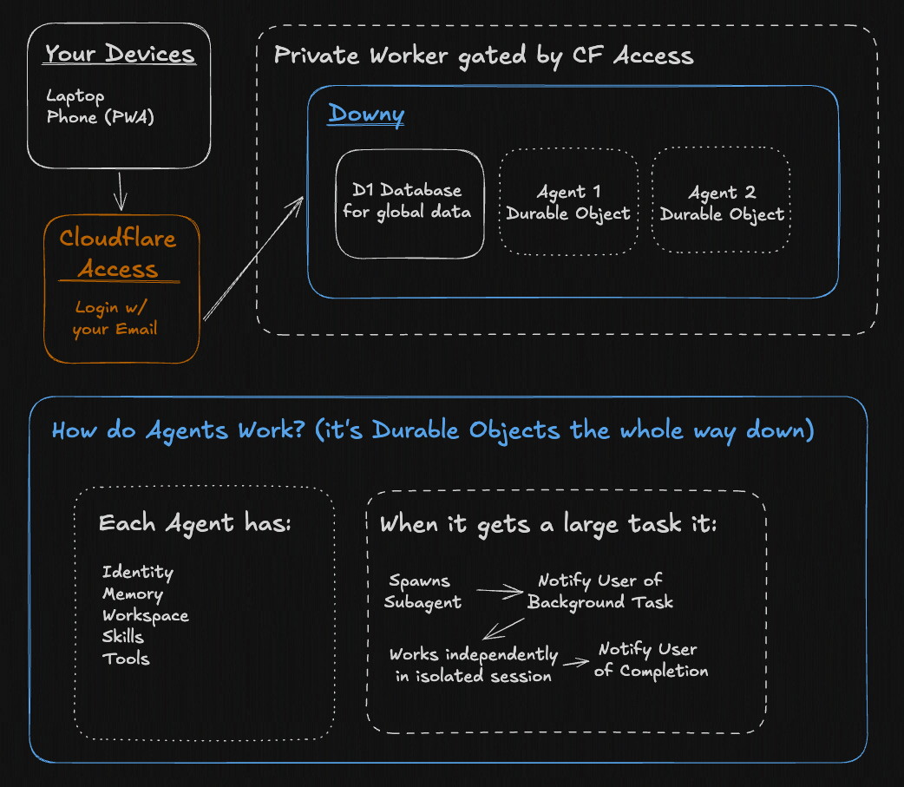

# ylstack-agents-stack

Build a team of agents and work with them from any device.

[](https://deploy.workers.cloudflare.com/?url=https://github.com/ylstack1/ylstack-agents-stack)

- Best UX for working with multiple agents.
- Each agent has its own personality, skills, tools, and workspace.
- OpenAI Sub compatible for frontier models at a flat rate. Or, use any model on OpenRouter or Workers AI.


## Why ylstack-agents-stack

- **Self-hosted.**
  - Runs in your Cloudflare account or locally.
- **Multi-agent w/ purpose built UX.**
  - Each agent has its own personality, skills, tools, and workspace.
  - Manage workspaces, tools, and background tasks directly in the app — no Obsidian, no CLI.
- **Use w/ any Model, including your OpenAI Sub.**
  - Kimi 2.6 on Workers AI by default — no API keys to wire up.
  - Swap in [ChatGPT Plus/Pro](#optional-chatgpt-subscription) or any OpenRouter model when you want.
- **Access anywhere.**
  - Reach ylstack-agents-stack from any device behind Cloudflare's secure network.

## Agent Types

**Lead Agent (slug: `default`)**
- The orchestrator of your agent ecosystem
- Has system control tools: `create_agent`, `archive_agent`, `write_peer_core_file`, `write_peer_skill`
- Coordinates sub-agents for complex tasks

**Sub-agents**
- Specialized agents with their own workspace, skills, and identity
- Configured by the Lead Agent via identity file edits or via the create dialog
- Template includes workspace/tool guidance and collaboration protocols

## How does it work?

I had been meaning to make something like ylstack-agents-stack for a while, but this blog post made me actually build it: https://blog.cloudflare.com/project-think/. I highly recommend reading it if you want to understand how ylstack-agents-stack works. But, basically each agent and subagent is its own Durable Object.



Full system map: [`docs/architecture.md`](docs/architecture.md).

## Known Issues & Notes

- **Route ordering**: The `/api/agents/:slug/sessions` endpoint must be checked before `/api/agents/` to avoid 404s (fixed in current version)
- **Sub-agent templates**: New sub-agents receive specialized identity templates focused on their role, not Lead Agent templates
- **Bootstrap workflow**: Agents go through a bootstrap ritual on first launch; this can be customized via the create dialog
- **Workspaces are isolated**: Each agent has its own `workspace/` directory in DO storage; use `read_peer_agent` to reference other agents

## Deploy

> [!WARNING]
> This is a brand new project being "agentically engineered" rapidly. It's self editing features are very powerful, but inherently prone to prompt injection like OpenClaw. Be considerate of what data and tools you give it access to. Use at your own risk.

You'll need:

- **Node 24 LTS** and **pnpm**:
  ```bash
  nvm install 24 && nvm use 24
  npm install -g pnpm
  ```
- **Cloudflare account** — the free Workers plan works if you bring your own model.
  - Workers AI (the default Kimi setup) needs the **Workers Paid plan** ($5/mo).
  - Pi proxy (ChatGPT) and OpenRouter both run on the free plan.
- **[Exa](https://exa.ai) API key** — free $10 credit, effectively unlimited for personal use. Required for search.

Clone the repo and install dependencies:

```bash
git clone https://github.com/bensenescu/ylstack-agents-stack
cd ylstack-agents-stack
pnpm install
```

Login into Cloudflare with Wrangler

```
npx wrangler login         # one-time browser OAuth to your Cloudflare account
```

Set up env vars and deploy:

- Set required secrets via `npx wrangler secret put`:
  ```bash
  npx wrangler secret put EXA_API_KEY
  ```
- Or set them through the Cloudflare Dashboard under your Worker's **Settings → Variables**.

```
pnpm deploy
```

By default, the Worker is open to the public. To protect your instance, we recommend setting up Cloudflare Access (see below).

## Optional Authentication: Cloudflare Access

To protect your ylstack-agents-stack instance from public access, you can put it behind Cloudflare Access. This gates all traffic until you've authenticated.

Here is how you set it up:

1. **Go to your Worker's settings** in the Cloudflare dashboard:
   - Open the sidebar and find **Workers & Pages**.
   - Click into your **ylstack-agents-stack** worker.
   - Open the **Settings** tab.
2. **Turn on Cloudflare Access:**
   - Under **Domains & Routes**, click the three-dot menu next to your `workers.dev` value.
   - Toggle **Cloudflare Access** on.
   - A modal pops up with your `TEAM_DOMAIN` and `POLICY_AUD`.
3. **Set those values as secrets:**
   - `npx wrangler secret put TEAM_DOMAIN` — paste `https://<team>.cloudflareaccess.com`
   - `npx wrangler secret put POLICY_AUD` — paste the `<aud-tag>`
4. `pnpm deploy`, then open your Worker URL and log in. If these variables are not set, ylstack-agents-stack will allow unauthenticated access.

<details>
<summary>Sign-in works but you still see "Authentication required"?</summary>

`pnpm tail` shows the verifier's failure reason — usually `TEAM_DOMAIN` missing `https://` or a stale `POLICY_AUD`.

</details>

<details>
<summary>Deploy fails with <code>VPC service ... does not exist</code>?</summary>

`PI_RELAY_VPC_SERVICE_ID` should be unset in `.env` by default. If you set it, either remove it or follow [`docs/pi-proxy-setup.md`](docs/pi-proxy-setup.md) to provision the VPC service.

</details>

## Optional: ChatGPT subscription

Point ylstack-agents-stack at your **ChatGPT Plus/Pro subscription** instead of Kimi:

- **Smarter models at a flat rate** — no per-token API billing.
- **Secure by network boundary** — a small proxy on your hardware holds the OAuth tokens, reached only via a Cloudflare Tunnel + Workers VPC binding (never the public internet).
- **Walkthrough:** [`docs/pi-proxy-setup.md`](docs/pi-proxy-setup.md).

> Note: OpenAI currently allows third-party harnesses to use ChatGPT subscriptions for personal use, but that policy could change.

## CI

```bash
pnpm run ci:check       # prettier + knip + tsc + oxlint
pnpm run format:write
pnpm run lint:fix
```